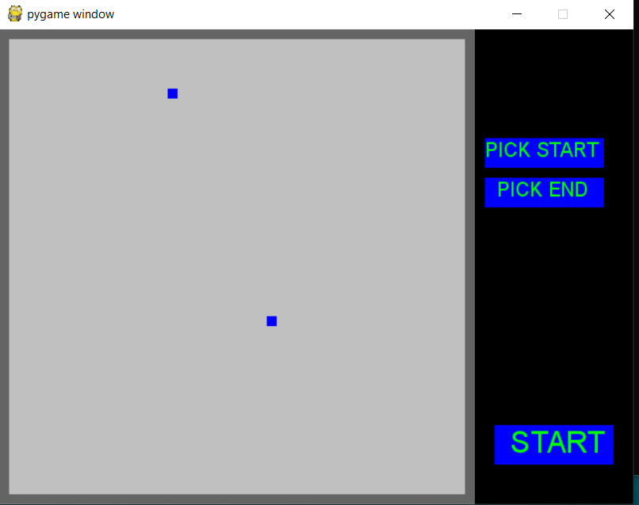

# Path-finding-visualizer
Visualization of finding path between 2 points in python/pygame.
Instructions:
To create walls just click left button on your mouse and move on the screen where you want to put walls.
To pick new starting point click with left button mouse on "PICK START" and click on point where you want to have new starting point also with left mouse button. 
To pick new destination point do the analogy but with "PICK END" button.

